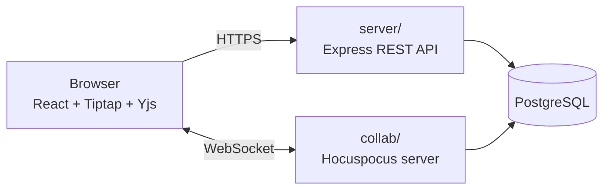

# Collab Docs

A real-time collaborative document editor (a small Google Docs). Several logged-in users
edit the same rich-text document at once and see each other's changes live, with
owner / editor / viewer permissions enforced on the server.

[](https://github.com/SyedAsharAhmd/Collab-Docs/actions/workflows/tests.yml)

**Live:** https://collab-docs-client-40sw.onrender.com


## Try it

Open the live link in **two different browsers** (or one normal and one private window)
and log in as two demo users. They share a welcome document with things to try.

| User | Email | Password | Role on the welcome document |
|---|---|---|---|
| Alice | `alice@demo.example.com` | `try-collab-docs` | owner: edit, share, rename, delete |
| Bob | `bob@demo.example.com` | `try-collab-docs` | editor: edit, rename |
| Carol | `carol@demo.example.com` | `try-collab-docs` | viewer: read only |

You can also register your own account and share documents by email.

> Hosted on Render's free tier: after 15 idle minutes the servers sleep, so the first
> visit can take about a minute. The demo accounts are public, so the welcome document
> may have been edited by others.

## Features

- Accounts with hashed passwords and token-based sessions
- Create, rename, share, and delete documents
- Rich text: bold, italic, headings, lists, undo/redo
- Live collaboration: everyone sees changes as they happen, and simultaneous edits merge
- Keep typing while offline; changes sync when the connection returns
- Editor and viewer roles, enforced on the server
- Removing someone's access takes effect immediately, even while they have the document open

## Architecture



| Part | Job |
|---|---|
| `client/` (React + Vite) | The UI and the editor |
| `server/` (Express) | Accounts, the document list, renaming, sharing, deleting |
| `collab/` (Hocuspocus) | The live content of open documents, over a WebSocket |
| PostgreSQL | Users, documents and their content, and who has which role |

- **Permissions:** every request and every live connection is checked against the
  database by the server that receives it. Nothing the browser says is trusted.
- **Live editing:** each browser keeps its own copy of the document. Changes are sent
  as small updates through the collab server to everyone else, and Yjs merges them so
  every copy ends up identical.
- **Saving:** the collab server saves open documents to PostgreSQL shortly after changes
  and when the last person leaves, and loads them from there when they are opened.

## Design decisions

- **Yjs for real-time sync.** Sending the whole document on every change would let
  simultaneous edits overwrite each other. Yjs is a proven CRDT: it merges edits from
  any number of people, in any order, and supports offline editing.
- **PostgreSQL.** The data is relational (users, documents, and who can access what),
  and the database enforces the rules: unique emails, valid roles, and documents that
  are never left without an owner.
- **Two servers.** Short HTTP requests and long-lived live connections are different
  workloads, so each runs, restarts, and scales on its own. Both share one database.
- **Documents you can't access return "not found".** This way nobody can discover
  whether a document exists by guessing its address.

## How it would scale

- **API:** it keeps no state between requests, so more copies can run behind a load
  balancer.
- **Collab server:** everyone editing one document must reach the same server. Route all
  connections for a document to one instance, or let instances share updates through
  Redis.

## Testing

| Suite | Tool | Tests |
|---|---|---|
| API | Vitest | 60 |
| Collab server | Vitest | 29 |
| Browser (Chrome, Firefox, WebKit) | Playwright | 21 |

The tests cover accounts, permissions, live sync between several users, offline edits,
saving and reloading, server restarts, and what happens when the database is down. All
suites run in GitHub Actions on every push. Local load tests are in [loadtest/](loadtest/).

## Security

- Passwords are hashed with bcrypt and never stored or logged in plain text
- Every request and live connection is authenticated and checked for permission on the server
- SQL queries are parameterized; the API only accepts requests from the app's own site
- Error messages to users are generic; details stay in the server logs
- Login attempts are rate limited

## Run it locally

**Prerequisites:** Node.js 22 or newer, and PostgreSQL 13 or newer.

1. Create two databases, one for development and one that tests may wipe:
   ```
   psql -U postgres -c "CREATE DATABASE collab_docs;"
   psql -U postgres -c "CREATE DATABASE collab_docs_test;"
   ```
2. Copy `server/.env.example` to `server/.env` and `collab/.env.example` to `collab/.env`,
   then fill in your database password and the **same** long random `JWT_SECRET` in both:
   ```
   node -e "console.log(require('crypto').randomBytes(48).toString('hex'))"
   ```
3. Install, create the tables, and add the demo users:
   ```
   cd server && npm install && npm run db:init
   cd ../collab && npm install && npm run seed:demo
   cd ../client && npm install
   ```
4. Start each in its own terminal: `npm run dev` in `server/`, `collab/`, and `client/`.
   Open http://localhost:5173.

**Tests:** `npm test` in `server/` and in `collab/`. For the browser tests (after step 3):
`cd e2e && npm install && npx playwright install && npx playwright test`.

## Project structure

```
client/     React + Vite app
server/     Express REST API and the database schema
collab/     Hocuspocus server and the demo data
e2e/        Playwright browser tests and the demo GIF recorder
loadtest/   Local load tests
render.yaml Deployment configuration for Render
```

## Deployment

Deployed on Render from [render.yaml](render.yaml): a PostgreSQL database, the two
servers, and the client as a static site. Secrets are set in the Render dashboard and
never committed.

## Known limitations

- One instance of each server
- Sessions last an hour; after that you log in again
- No password reset, email verification, or account deletion
- No version history, other users' cursors, or comments
