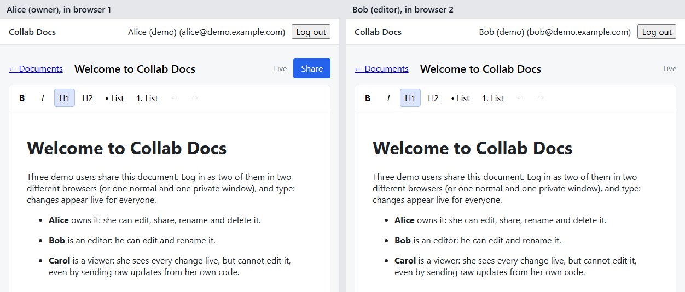
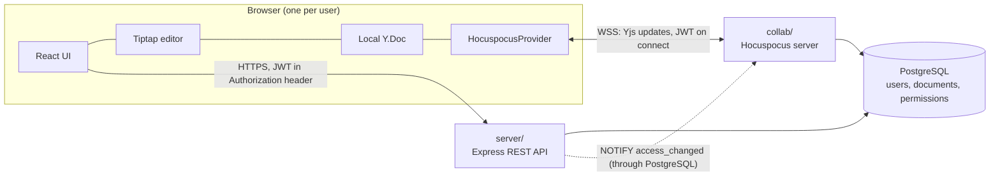

# Collab Docs

A real-time collaborative document editor (a small Google Docs). Several logged-in users
edit the same rich-text document at once and see each other's changes live, with
owner / editor / viewer permissions enforced on the server.

[](https://github.com/SyedAsharAhmd/Collab-Docs/actions/workflows/tests.yml)

**Live:** https://collab-docs-client-40sw.onrender.com



## Try it

Open the live link in **two different browsers** (or one normal and one private window)
and log in as two demo users. They share a welcome document with things to try.

| User | Email | Password | Role on the welcome document |
|---|---|---|---|
| Alice | `alice@demo.example.com` | `try-collab-docs` | owner: edit, share, rename, delete |
| Bob | `bob@demo.example.com` | `try-collab-docs` | editor: edit, rename |
| Carol | `carol@demo.example.com` | `try-collab-docs` | viewer: read only |

You can also register your own account and share documents by email.

> Hosted on Render's free tier: after 15 idle minutes the servers sleep, so the first
> visit can take about a minute. The demo accounts are public, so the welcome document
> may have been edited; it is recreated on the next deploy if deleted.

## Features

- Accounts with bcrypt-hashed passwords and JWT sessions
- Documents: create, list, rename, delete
- Rich text with Tiptap: bold, italic, headings, lists, undo/redo (only your own changes)
- Live collaboration with Yjs: concurrent edits merge, and everyone ends up with the same text
- Offline editing: keep typing without a connection; changes merge when it returns
- Sharing by email as **editor** or **viewer**; viewers are read-only on the server
- Revoking access or deleting a document disconnects affected users immediately
- An expired session asks you to log in again over the page, keeping unsaved work

## Architecture



Two separate Node processes share one PostgreSQL database and one JWT secret:

| Process | Handles | Talks over |
|---|---|---|
| `server/` (Express) | register, login, document list/create/rename/delete, sharing | HTTPS request/response |
| `collab/` (Hocuspocus) | the live content of open documents | a WebSocket kept open per document |
| `client/` (React + Vite) | the UI; each open document has its own `Y.Doc` | both of the above |

**Who you are vs. what you may do.** The JWT proves identity. Permissions are read fresh
from the `permissions` table on every REST request and every WebSocket connection, by
each server independently; neither trusts the browser or the other server.

**Live editing.** Every browser holds a full copy of the document as a Yjs `Y.Doc`.
Typing changes the local copy at once; the provider sends a small update to the collab
server, which applies it to its own copy and relays it to everyone else in the document.
Yjs is a CRDT: updates merge in any order, even duplicated, and every copy converges.

**Persistence.** An open document lives in the collab server's memory. It is saved to
`documents.ydoc_state` (the full Yjs state as bytes) 2 s after typing pauses, at least
every 10 s during continuous typing, when the last user leaves, and on shutdown. When
opened, it is loaded from there. If loading fails, the connection is refused: opening an
empty document instead would let the next save overwrite the real content.

**Access changes.** When an owner removes someone, changes a role, or deletes a document,
the API sends `pg_notify('access_changed', …)` inside the same transaction. The collab
server `LISTEN`s and closes the affected connections; clients reconnect and are checked
again, so a downgraded editor comes back read-only and a removed user is refused.

## Design decisions and trade-offs

**Yjs (a CRDT) for sync.** Sending the whole document on each change means "last write
wins": two people typing, or two requests arriving out of order, overwrite each other.
Operational Transformation solves this but needs a central server to transform every
operation and is notoriously hard to get right. A CRDT like Yjs merges edits from any
order without coordination, works offline, and is battle-tested; writing our own would
be a research project.

**PostgreSQL.** The data is relational (users, documents, and a many-to-many permission
table), and the database enforces the rules: unique emails, foreign keys with cascade
deletes, a check on roles, and transactions so a document is never created without its
owner. It also stores the Yjs state as `bytea`, and its `LISTEN/NOTIFY` connects the two
servers without adding a message queue.

**Two servers.** Short HTTP requests and long-lived WebSocket connections holding
documents in memory are different workloads; separating them lets each restart, scale,
and deploy on its own. The cost: both check permissions, and both need the same secret.

**404, not 403, for documents you can't access.** "Doesn't exist" and "not shared with
you" get the identical answer, so document IDs can't be probed. A 403 is used only when
you can see a document but your role is too low (e.g. a viewer renaming).

**Viewers are read-only on the server.** Hiding the toolbar is UX only; the collab server
marks viewer connections read-only and drops any update they send. A test sends raw Yjs
updates from a viewer's own client and checks the document is unchanged.

**Stateless JWTs (1 hour) in `localStorage`.** Simple and needs no session store, but a
token can't be cancelled before it expires, and any script on the page could read it.
Every sensitive check still reads the database (user exists, current role). An expired
session shows a re-login dialog over the page so unsaved work survives. Refresh tokens
in an `httpOnly` cookie would be the next step; on Render the client and API sit on
different sites, where browsers increasingly block such cookies, so it would need a
custom domain.

**Rate limiting on login and register.** bcrypt takes about 300 ms of the API's only
thread per attempt, so unlimited attempts would let one client slow down everyone. The
API allows 20 attempts per minute per IP and 5 login attempts per 15 minutes per email,
checked before bcrypt runs. Counts are kept in memory (one instance).

**The full state is saved, not an update log.** Simple and fast to load; the trade-off is
writing the whole document on each save, and no version history. Storing updates and
compacting them periodically would add history.

## How it would scale

- **REST API:** stateless, so add instances behind a load balancer. The in-memory rate
  limiter would move to Redis so the limits hold across instances.
- **Collab server:** everyone editing one document must share one in-memory `Y.Doc`.
  Either route all connections for a document to the same instance (sticky routing by
  document ID), or run instances that exchange updates through Redis pub/sub (Hocuspocus
  has an extension for this). `LISTEN/NOTIFY` already reaches every instance.
- **Measured locally** (one laptop, one CPU core per server): the collab server kept every
  copy identical and saved at every level, with p95 latency of 11 ms at 50 users and
  178 ms at 500 users typing nonstop; it saturates near 1,000. Details in
  [loadtest/README.md](loadtest/README.md).

## Testing

| Suite | Tool | Tests | What it covers |
|---|---|---|---|
| API | Vitest | 60 | auth, validation, 404 vs 403, sharing, CORS, 503 when the database is down, rate limiting |
| Collab server | Vitest | 29 | token and role checks, read-only viewers, sync with 2 and 3 users, reordered and duplicated updates, offline merge, persistence, restarts, revoked access, message size limit, demo seed |
| Browser | Playwright | 21 | 7 flows × Chrome, Firefox, WebKit: live sync, viewer, reload, access removed, document deleted, session expiry with offline edits |

All three suites run in GitHub Actions on every push, against a fresh PostgreSQL. Most
tests are integration tests against a real database and a real WebSocket server, because
the risky parts are how the pieces interact. The key safety tests were checked by
removing the protection and confirming the test fails.

Load tests (`loadtest/`) run locally only and are not part of CI.

## Security summary

- Passwords hashed with bcrypt (cost 12); never logged; same error and timing for unknown
  email and wrong password
- JWT signature and expiry verified on every request and every WebSocket connection; the
  algorithm is pinned
- Permissions checked server-side on every document operation, by both servers
- Parameterized SQL only; CORS restricted to the client's origin
- Generic error messages to clients (500, or 503 when the database is unreachable); details
  only in server logs
- Rate-limited login and register; WebSocket messages capped at 10 MB

## Run it locally

**Prerequisites:** Node.js 22 or newer, and PostgreSQL 13 or newer.

1. Create two databases, one for development and one that tests may wipe:
   ```
   psql -U postgres -c "CREATE DATABASE collab_docs;"
   psql -U postgres -c "CREATE DATABASE collab_docs_test;"
   ```
2. Copy `server/.env.example` to `server/.env` and `collab/.env.example` to `collab/.env`,
   then fill in your database password and the **same** long random `JWT_SECRET` in both:
   ```
   node -e "console.log(require('crypto').randomBytes(48).toString('hex'))"
   ```
3. Install, create the tables, and add the demo users:
   ```
   cd server && npm install && npm run db:init
   cd ../collab && npm install && npm run seed:demo
   cd ../client && npm install
   ```
4. Start each in its own terminal: `npm run dev` in `server/`, `collab/`, and `client/`.
   Open http://localhost:5173.

**Tests:** `npm test` in `server/` and in `collab/`. For the browser tests (after step 3):
`cd e2e && npm install && npx playwright install && npx playwright test` (it starts its own
servers on separate ports against the test database).

## Project structure

```
client/     React + Vite app (pages, Tiptap editor, collaboration hook)
server/     Express REST API (auth, documents, sharing) and db/schema.sql
collab/     Hocuspocus server (auth hook, persistence, access listener, demo seed)
e2e/        Playwright browser tests and the demo GIF recorder
loadtest/   Local load tests and results
render.yaml Render Blueprint: database, both servers, static client
```

## Deployment

Deployed on Render from [render.yaml](render.yaml): a PostgreSQL database, the API and
collab server as Node web services (the collab server over WSS), and the client as a
static site. Secrets (`JWT_SECRET`, `CLIENT_ORIGIN`, and the client's `VITE_API_URL` /
`VITE_COLLAB_URL`) are set in the Render dashboard, never committed.

## Known limitations

- One instance of each server; no horizontal scaling (see above)
- Sessions last an hour with no refresh token; you log in again after that
- No password reset, email verification, or account deletion
- No version history, cursors of other users, or comments
- Render's free PostgreSQL is deleted 30 days after creation
